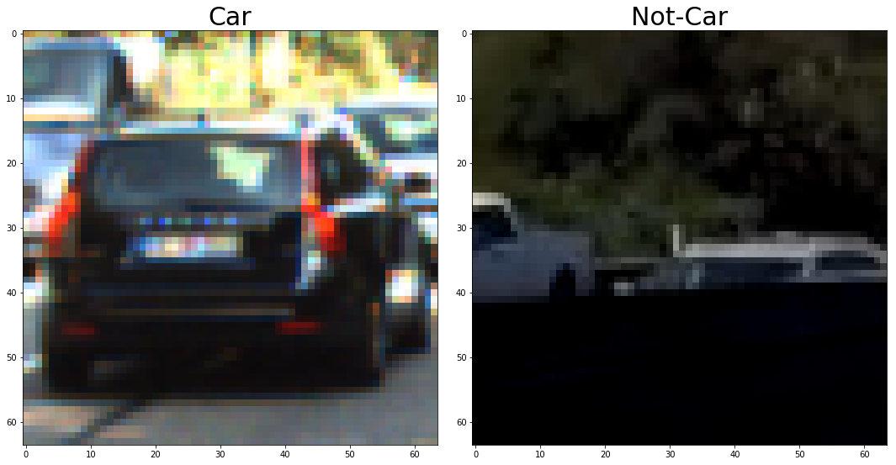
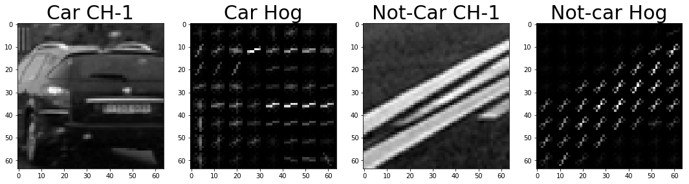
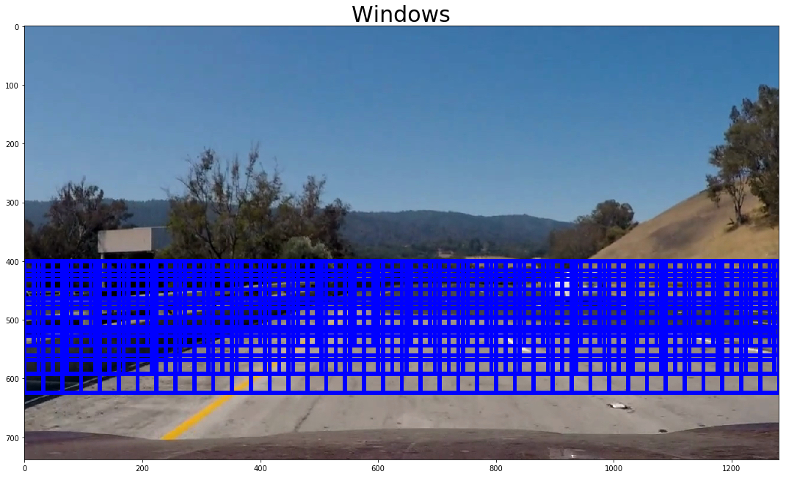
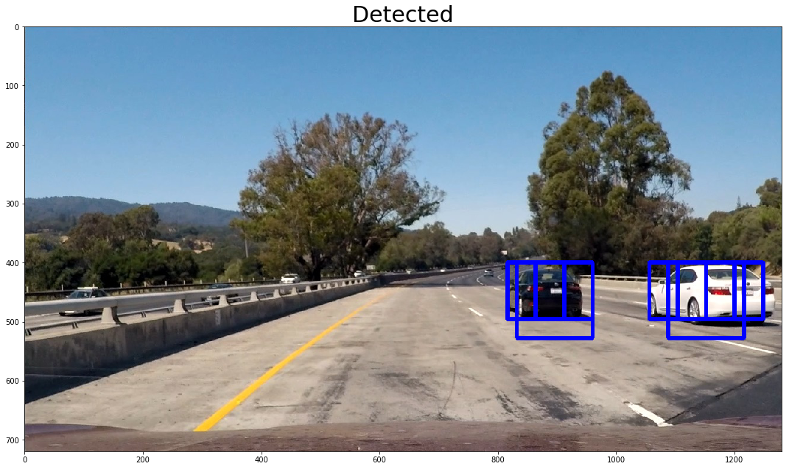
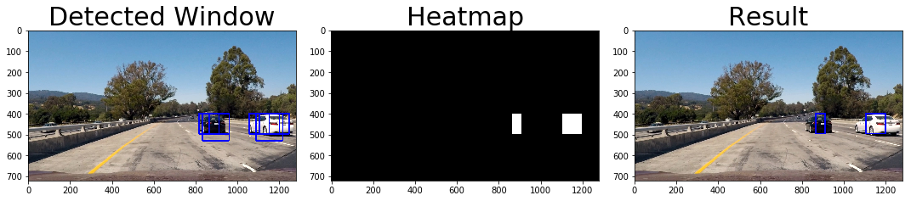

# Vehicle detection


## Introduction

The goals / steps of this project are the following:

* Perform a Histogram of Oriented Gradients (HOG) feature extraction on a labeled training set of images and train a classifier Linear SVM classifier
* Optionally, you can also apply a color transform and append binned color features, as well as histograms of color, to your HOG feature vector.
* Note: for those first two steps don't forget to normalize your features and randomize a selection for training and testing.
* Implement a sliding-window technique and use your trained classifier to search for vehicles in images.
* Run your pipeline on a video stream (start with the test_video.mp4 and later implement on full project_video.mp4) and create a heat map of recurring detections frame by frame to reject outliers and follow detected vehicles.
* Estimate a bounding box for vehicles detected.

## Process Step

Load the required modules and define the functions to proceed with each step.


```python
import cv2
import numpy as np
import matplotlib.pyplot as plt
import matplotlib.image as mpimg

%matplotlib inline
%load_ext autoreload
%autoreload 2
```


```python
def show_images(row, col, images, titles, h_pad=None, w_pad=None, fontsize=30):
    fig, axes = plt.subplots(row, col, figsize=(15, 15))
    fig.tight_layout(h_pad=h_pad)

    if row == 1 and col == 1:
        axes.imshow(images[0], cmap='gray')
        axes.set_title(titles[0], fontsize=fontsize)
    elif row == 1:
        idx = 0
        for ax in axes:
            ax.imshow(images[idx], cmap='gray')
            ax.set_title(titles[idx], fontsize=fontsize)
            idx += 1
    else:
        idx = 0
        for axes_row in axes:
            for ax in axes_row:
                ax.imshow(images[idx], cmap='gray')
                ax.set_title(titles[idx], fontsize=fontsize)
                idx += 1

    plt.show()
```


```python
import random
def get_random_image(images, rgb=True):
    idx = random.randint(0, len(images))
    image = cv2.imread(images[idx])

    if rgb:
        image = cv2.cvtColor(image, cv2.COLOR_BGR2RGB)

    return image
```

### 1. Extract features and train classifier

#### 1. Read all images data

For this project, I used a labeled dataset for [vehicle](https://s3.amazonaws.com/udacity-sdc/Vehicle_Tracking/vehicles.zip) and [non-vehicle](https://s3.amazonaws.com/udacity-sdc/Vehicle_Tracking/non-vehicles.zip) to train my classifier. These example images come from a combination of the GTI vehicle image database, the KITTI vision benchmark suite, and examples extracted from the project video itself.


```python
import glob

car_images = glob.glob('./data/vehicles/**/*.png')
notcar_images = glob.glob('./data/non-vehicles/**/*.png')

num_of_car_images = len(car_images)
num_of_notcar_images = len(notcar_images)

print('Number of Car images = {}'.format(num_of_car_images))
print('Number of Not-Car images = {}'.format(num_of_notcar_images))
```

    Number of Car images = 8792
    Number of Not-Car images = 8968


```python
car = get_random_image(car_images)
notcar = get_random_image(notcar_images)

show_images(1, 2, [car, notcar], ['Car', 'Not-Car'])
```





#### 2. Extract features

I used color features, color of histogram features and HOG features. Below is the parameters to train my classifier and HOG features example.


```python
color_space = 'YCrCb'
spatial_size = (16, 16)
hist_bins = 32
orient = 9
pix_per_cell = 8
cell_per_block = 2
hog_channel = 'ALL'
spatial_feat = True
hist_feat = True
hog_feat = True

import feature

car = get_random_image(car_images)
notcar = get_random_image(notcar_images)

car_y = cv2.cvtColor(car, cv2.COLOR_RGB2YCrCb)[:, :, 0]
notcar_y = cv2.cvtColor(notcar, cv2.COLOR_RGB2YCrCb)[:, :, 0]

hog, car_hog = feature.get_hog_features(car_y, orient, pix_per_cell, cell_per_block, vis=True)
hog, notcar_hog = feature.get_hog_features(notcar_y, orient, pix_per_cell, cell_per_block, vis=True)

show_images(1, 4,
            [car_y, car_hog, notcar_y, notcar_hog,],
            ['Car CH-1', 'Car Hog', 'Not-Car CH-1', 'Not-car Hog',],
            h_pad=3.0,
            fontsize=30)
```





#### 3. Train classifier

I chose Linear SVM as my classifier. To train my classifier I extracted features from data, scaled and trained them. After training I saved the model and parameters to use. The detailed code is in train.py.

### 2. Slide window


```python
import pickle

dist_pickle = pickle.load(open("./svc_pickle.p", "rb" ))

color_space = dist_pickle["color_space"]
svc = dist_pickle["svc"]
X_scaler = dist_pickle["scaler"]
orient = dist_pickle["orient"]
pix_per_cell = dist_pickle["pix_per_cell"]
cell_per_block = dist_pickle["cell_per_block"]
spatial_size = dist_pickle["spatial_size"]
hog_channel = dist_pickle["hog_channel"]
hist_bins = dist_pickle["hist_bins"]
spatial_feat = dist_pickle["spatial_feat"]
hist_feat = dist_pickle["hist_feat"]
hog_feat = dist_pickle["hog_feat"]
```


```python
# Define a function to draw bounding boxes
def draw_boxes(img, bboxes, color=(0, 0, 255), thick=6):
    # Make a copy of the image
    imcopy = np.copy(img)
    # Iterate through the bounding boxes
    for bbox in bboxes:
        # Draw a rectangle given bbox coordinates
        cv2.rectangle(imcopy, bbox[0], bbox[1], color, thick)
    # Return the image copy with boxes drawn
    return imcopy
```

I searched vehicle using multi-scale windows.


```python
from search import slide_window, search_windows

image = mpimg.imread('test_images/test7.jpg')
windows_image = np.copy(image)
x_start_stop = [None, None]
xy_overlap = (0.75, 0.75)

y_start_stops = [[400, 645],
                 [400, 600],
                 [400, 550]]
xy_windows = [(128, 128),
              (96, 96),
              (64, 64)]

windows = []

for y_start_stop, xy_window in zip(y_start_stops, xy_windows):
    windows.extend(slide_window(image, x_start_stop, y_start_stop, xy_window, xy_overlap))

windows_image = draw_boxes(image, windows, color=(0, 0, 255), thick=6)
show_images(1, 1, [windows_image], ['Windows'])
```





Then I searched vehicles using search_windows.


```python
from search import slide_window, search_windows

image = mpimg.imread('test_images/test1.jpg')
draw_image = np.copy(image)

image = image.astype(np.float32)/255

x_start_stop = [None, None]
xy_overlap = (0.5, 0.5)
y_start_stops = [[400, 645],
                 [400, 600],
                 [400, 550]]
xy_windows = [(128, 128),
              (96, 96),
              (64, 64)]

windows = []

for y_start_stop, xy_window in zip(y_start_stops, xy_windows):
    windows.extend(slide_window(image, x_start_stop, y_start_stop, xy_window, xy_overlap))

hot_windows = search_windows(image, windows, svc, X_scaler, color_space=color_space,
                        spatial_size=spatial_size, hist_bins=hist_bins,
                        orient=orient, pix_per_cell=pix_per_cell,
                        cell_per_block=cell_per_block,
                        hog_channel=hog_channel, spatial_feat=spatial_feat,
                        hist_feat=hist_feat, hog_feat=hog_feat)

window_img = draw_boxes(draw_image, hot_windows, color=(0, 0, 255), thick=6)


show_images(1, 1, [window_img], ['Detected'])

```





### 3. Remove false positive and overlapping

In the last step, I removed false positives and some overlappings.


```python
from search import slide_window, search_windows
from heatmap import *

image = mpimg.imread('test_images/test1.jpg')
draw_image = np.copy(image)

image = image.astype(np.float32)/255

x_start_stop = [None, None]
xy_overlap = (0.5, 0.5)
y_start_stops = [[400, 645],
                 [400, 600],
                 [400, 550]]
xy_windows = [(128, 128),
              (96, 96),
              (64, 64)]

windows = []

for y_start_stop, xy_window in zip(y_start_stops, xy_windows):
    windows.extend(slide_window(image, x_start_stop, y_start_stop, xy_window, xy_overlap))

hot_windows = search_windows(image, windows, svc, X_scaler, color_space=color_space,
                        spatial_size=spatial_size, hist_bins=hist_bins,
                        orient=orient, pix_per_cell=pix_per_cell,
                        cell_per_block=cell_per_block,
                        hog_channel=hog_channel, spatial_feat=spatial_feat,
                        hist_feat=hist_feat, hog_feat=hog_feat)

window_img = draw_boxes(draw_image, hot_windows, color=(0, 0, 255), thick=6)

heat = np.zeros_like(image[:,:,0]).astype(np.float)

heat = add_heat(heat, hot_windows)

heat = apply_threshold(heat, 2)

heatmap = np.clip(heat, 0, 255)

labels = label(heatmap)
draw_img = draw_labeled_bboxes(np.copy(draw_image), labels)


show_images(1, 3, [window_img, heatmap, draw_img], ['Detected Window', 'Heatmap', 'Result'])

```





## Result and Thoughts

[](https://www.youtube.com/watch?v=R2h0aC3q9Cc)

- It takes a lot of time to detect vehicle. I need to try another method like [YOLO](https://pjreddie.com/darknet/yolo/).

- My detection boxes are really wobbly and does not fit to the vehicle. I will try to solve it.
